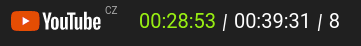

# yTime

My YouTube watch/visit time display and excuse to play with `proxy` API & Chrome extensions.

## Features

It does little:

- show watchtime & visit time that day
- show number of seen videos that day
- blocks YT
- color changes in relation to the avg watchime

Interestingly and sadly, custom elements are not supported as Chrome extensions [see](https://stackoverflow.com/questions/42800035/why-cant-you-create-custom-elements-in-content-scripts).

## How to run it

- `npm run build`
- install Tampermonkey http://tampermonkey.net/
- add to head `@require file:///your/path/ytime/public/index.js`

## Unlikely improvements

- [ ] create config json (to set when/if to block video after some watch time)
- [ ] show statistics
- [ ] make it nice
- [ ] play with IndexDB
